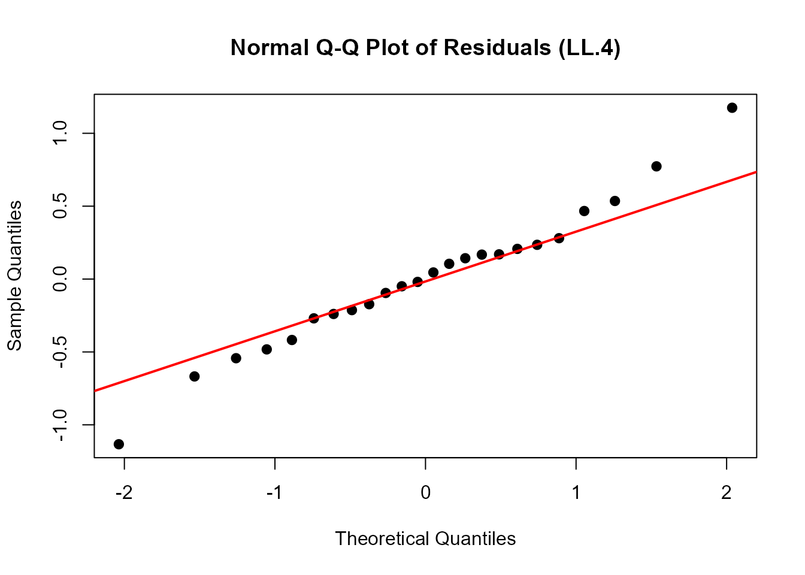
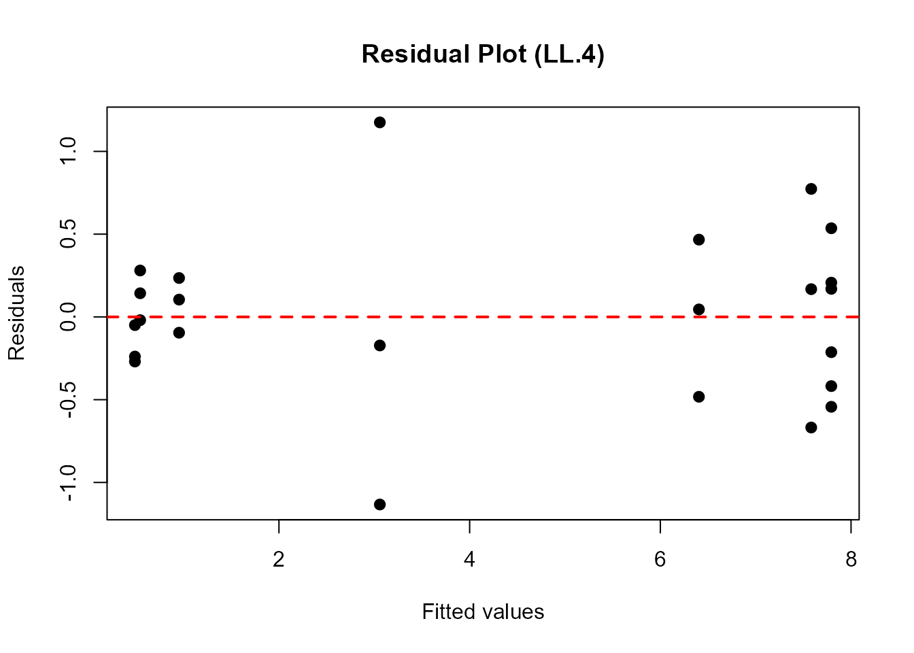
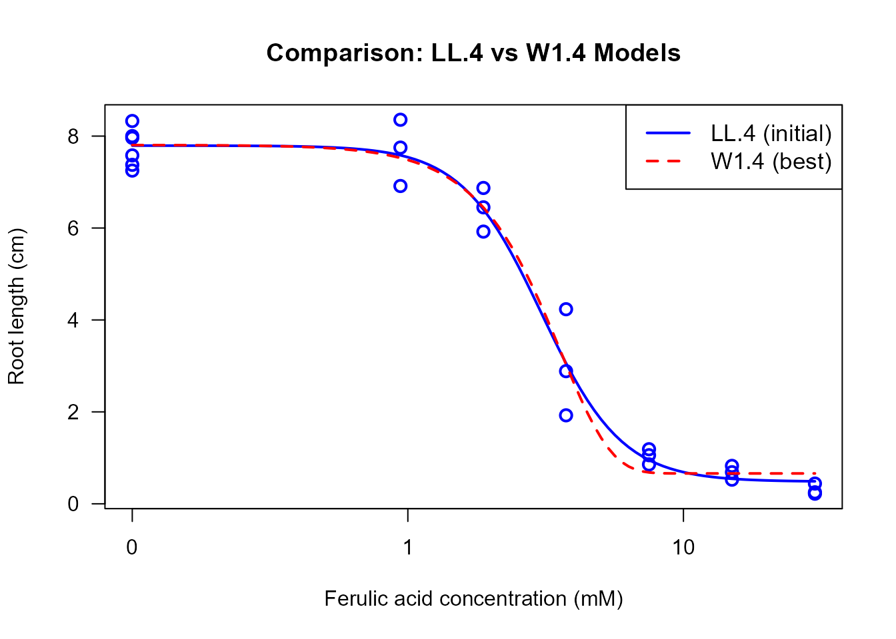
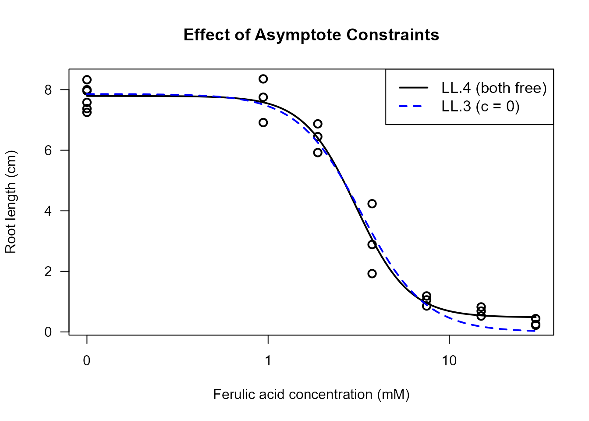
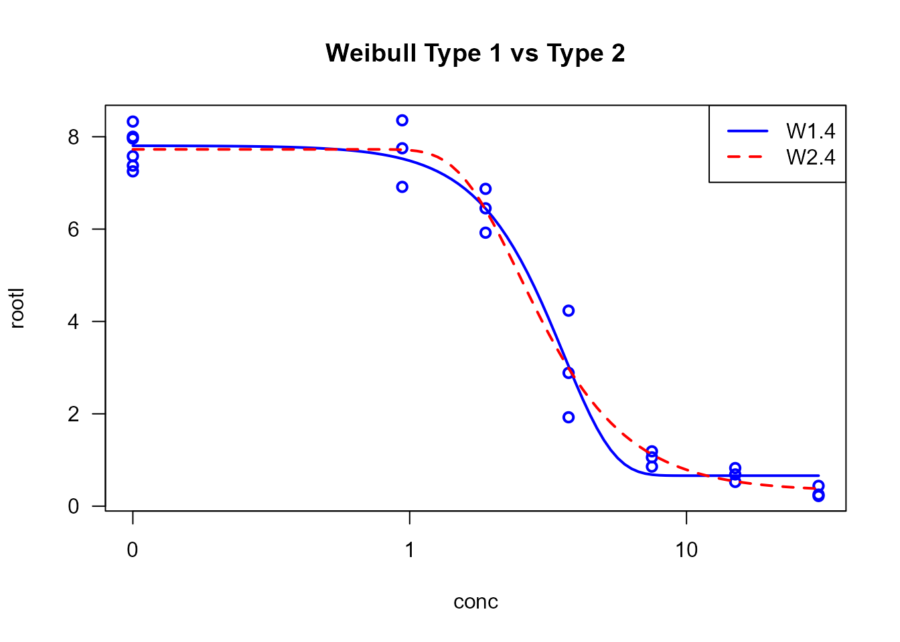

# A Practical Workflow for Dose-Response Analysis

## Executive Summary

This vignette provides a comprehensive, step-by-step workflow for
conducting proper dose-response analysis using the `drc` package. We
demonstrate the complete analysis process from initial model fitting
through model selection, validation, and interpretation. By following
this workflow, even inexperienced users can perform rigorous
dose-response modeling while avoiding common pitfalls.

## Introduction

Dose-response analysis is fundamental in toxicology, ecotoxicology,
pharmacology, and related fields. The relationship between dose (or
concentration) and biological response often follows non-linear patterns
that require specialized statistical models. The `drc` package provides
a comprehensive framework for fitting, comparing, and interpreting
dose-response models.

### What You Will Learn

This vignette demonstrates a complete workflow including:

1.  Initial exploratory model fitting
2.  Visual assessment of model adequacy
3.  Statistical evaluation of model fit
4.  Systematic model comparison and selection
5.  Model-averaged estimation for robust inference
6.  Understanding the impact of parameter constraints
7.  Choosing appropriate models for different data types

### The Example Dataset

We will use the `ryegrass` dataset, which contains measurements of root
length in perennial ryegrass (*Lolium perenne L.*) exposed to different
concentrations of ferulic acid, a phenolic compound that inhibits plant
growth.

``` r
# Load the ryegrass dataset
data(ryegrass)

# Examine the data structure
head(ryegrass, 10)
#>       rootl conc
#> 1  7.580000 0.00
#> 2  8.000000 0.00
#> 3  8.328571 0.00
#> 4  7.250000 0.00
#> 5  7.375000 0.00
#> 6  7.962500 0.00
#> 7  8.355556 0.94
#> 8  6.914286 0.94
#> 9  7.750000 0.94
#> 10 6.871429 1.88

# Summary statistics
summary(ryegrass)
#>      rootl             conc       
#>  Min.   :0.2200   Min.   : 0.000  
#>  1st Qu.:0.8491   1st Qu.: 0.705  
#>  Median :5.0778   Median : 2.815  
#>  Mean   :4.3272   Mean   : 7.384  
#>  3rd Qu.:7.4262   3rd Qu.: 9.375  
#>  Max.   :8.3556   Max.   :30.000

# Simple exploratory plot
plot(rootl ~ conc, data = ryegrass,
     xlab = "Ferulic acid concentration (mM)",
     ylab = "Root length (cm)",
     main = "Ryegrass Root Growth vs. Ferulic Acid Concentration",
     pch = 16, cex = 1.2)
```


The dataset contains 24 observations with: - `conc`: Ferulic acid
concentration in millimolar (mM) - `rootl`: Root length in centimeters
(cm)

We observe a clear dose-response relationship: as the concentration
increases, root length decreases, indicating an inhibitory effect of
ferulic acid on ryegrass root growth.

## Step 1: Initial Model Fitting

### Choosing a Starting Model

For a typical monotonic dose-response curve, the four-parameter
log-logistic model (`LL.4`) is an excellent starting point. It is
flexible, well-characterized, and commonly used in toxicology.

The `LL.4` model has the form:

``` math
f(x) = c + \frac{d-c}{1 + \exp(b(\log(x) - \log(e)))}
```

where: - **b**: Slope parameter (steepness of the curve) - **c**: Lower
asymptote (response at infinite dose) - **d**: Upper asymptote (response
at zero dose, control response) - **e**: ED50 or EC50 (dose producing
50% of the maximal effect)

### Fitting the Initial Model

``` r
# Fit a four-parameter log-logistic model
ryegrass.LL4 <- drm(rootl ~ conc, data = ryegrass, fct = LL.4())

# Display model summary
summary(ryegrass.LL4)
#> 
#> Model fitted: Log-logistic (ED50 as parameter) (4 parms)
#> 
#> Parameter estimates:
#> 
#>               Estimate Std. Error t-value   p-value    
#> b:(Intercept)  2.98222    0.46506  6.4125 2.960e-06 ***
#> c:(Intercept)  0.48141    0.21219  2.2688   0.03451 *  
#> d:(Intercept)  7.79296    0.18857 41.3272 < 2.2e-16 ***
#> e:(Intercept)  3.05795    0.18573 16.4644 4.268e-13 ***
#> ---
#> Signif. codes:  0 '***' 0.001 '**' 0.01 '*' 0.05 '.' 0.1 ' ' 1
#> 
#> Residual standard error:
#> 
#>  0.5196256 (20 degrees of freedom)
```

The summary provides: - Parameter estimates and their standard errors -
Residual standard error - Model convergence information

**Interpretation of Parameters:** - The `d` parameter (upper limit)
represents the control root length (at zero concentration) - The `c`
parameter (lower limit) represents the minimum root length at high
concentrations - The `e` parameter (ED50) is the concentration causing
50% reduction from control - The `b` parameter controls the steepness of
the dose-response curve

## Step 2: Visual Assessment of Model Fit

Visual diagnostics are crucial for assessing whether the fitted model
adequately describes the data. We use two primary tools: the standard
dose-response plot and quantile-quantile (Q-Q) plots.

### Standard Dose-Response Plot

``` r
# Plot the fitted model with data points
plot(ryegrass.LL4, type = "all",
     main = "LL.4 Model Fit to Ryegrass Data",
     xlab = "Ferulic acid concentration (mM)",
     ylab = "Root length (cm)",
     lwd = 2, cex = 1.2)
```


The plot shows: - Observed data points - Fitted dose-response curve -
Overall pattern of fit

**What to Look For:** - Do the fitted values follow the general trend of
the data? - Are there systematic deviations (e.g., all points above or
below the curve in certain regions)? - Are there outliers that might
influence the fit?

### Quantile-Quantile (Q-Q) Plot

Q-Q plots assess whether the model residuals follow a normal
distribution, which is an assumption of the fitting procedure.

``` r
# Create Q-Q plot for residual diagnostics
qqnorm(residuals(ryegrass.LL4),
       main = "Normal Q-Q Plot of Residuals (LL.4)",
       pch = 16, cex = 1.2)
qqline(residuals(ryegrass.LL4), col = "red", lwd = 2)
```



**Interpretation:** - Points should fall approximately along the
diagonal line - Systematic deviations suggest non-normality of
residuals - Deviations at the extremes are common and often acceptable -
Severe deviations may indicate model inadequacy or outliers

### Residual Plot

An additional useful diagnostic is plotting residuals against fitted
values:

``` r
# Residuals vs. Fitted values
plot(fitted(ryegrass.LL4), residuals(ryegrass.LL4),
     xlab = "Fitted values",
     ylab = "Residuals",
     main = "Residual Plot (LL.4)",
     pch = 16, cex = 1.2)
abline(h = 0, col = "red", lwd = 2, lty = 2)
```



**What to Look For:** - Random scatter around zero (no systematic
pattern) - Constant variance across fitted values (homoscedasticity) -
No obvious outliers or influential points

## Step 3: Statistical Evaluation of Model Fit

Beyond visual assessment, we use formal statistical tests to evaluate
model adequacy and significance.

### Test for Dose Effect: noEffect()

The
[`noEffect()`](https://hreinwald.github.io/drc/reference/noEffect.md)
function performs a likelihood ratio test comparing the dose-response
model to a null model (no dose effect).

``` r
# Test whether there is a significant dose effect
noEffect(ryegrass.LL4)
#> Chi-square test              Df         p-value 
#>        91.87776         3.00000         0.00000
```

**Interpretation:** - The null hypothesis is “no dose effect” (all
responses are equal) - A significant p-value (\< 0.05) indicates that
the dose-response model fits significantly better than the null model -
This confirms that ferulic acid concentration has a significant effect
on root length

### Goodness-of-Fit Test: modelFit()

The
[`modelFit()`](https://hreinwald.github.io/drc/reference/modelFit.md)
function assesses whether the model adequately describes the data using
a lack-of-fit test.

``` r
# Perform goodness-of-fit test
modelFit(ryegrass.LL4)
#> Lack-of-fit test
#> 
#>           ModelDf    RSS Df F value p value
#> ANOVA          17 5.1799                   
#> DRC model      20 5.4002  3  0.2411  0.8665
```

**Interpretation:** - This test compares the fitted model to a saturated
model (perfect fit) - A **non-significant** p-value suggests adequate
fit (model is not significantly worse than perfect fit) - A significant
p-value indicates lack of fit (model may be inadequate) - **Note:** This
test requires replication at dose levels

### Estimating Effective Doses: ED()

Effective dose (ED) or effective concentration (EC) values are key
outputs in dose-response analysis. They represent the dose required to
produce a specified level of effect.

``` r
# Estimate EC10, EC20, and EC50 with 95% confidence intervals
# Using delta method for confidence intervals
ed_values <- ED(ryegrass.LL4, respLev = c(10, 20, 50), interval = "delta")
#> 
#> Estimated effective doses
#> 
#>        Estimate Std. Error   Lower   Upper
#> e:1:10  1.46371    0.18677 1.07411 1.85330
#> e:1:20  1.92109    0.17774 1.55032 2.29186
#> e:1:50  3.05795    0.18573 2.67053 3.44538
ed_values
#>        Estimate Std. Error    Lower    Upper
#> e:1:10 1.463706  0.1867704 1.074109 1.853302
#> e:1:20 1.921091  0.1777432 1.550325 2.291857
#> e:1:50 3.057955  0.1857313 2.670526 3.445384
```

**Understanding ED Values:** - **EC10**: Concentration causing 10%
effect (reduction in root length) - **EC20**: Concentration causing 20%
effect - **EC50**: Concentration causing 50% effect (often used as a
summary measure of potency)

**Confidence Intervals:** - The `interval = "delta"` argument uses the
delta method for CI estimation - Alternative methods include `"fls"`
(fieller), `"tfls"` (transformed fieller) - Narrower CIs indicate more
precise estimates

### Alternative Confidence Interval Methods

``` r
# Compare different confidence interval methods
cat("Delta method:\n")
#> Delta method:
ED(ryegrass.LL4, respLev = 50, interval = "delta")
#> 
#> Estimated effective doses
#> 
#>        Estimate Std. Error   Lower   Upper
#> e:1:50  3.05795    0.18573 2.67053 3.44538

cat("\nFieller method:\n")
#> 
#> Fieller method:
ED(ryegrass.LL4, respLev = 50, interval = "fls")
#> 
#> Estimated effective doses
#> 
#>        Estimate  Lower  Upper
#> e:1:50   21.284 14.448 31.355
```

The Fieller method is often preferred for ED50 estimation as it accounts
for the ratio nature of the parameter.

## Step 4: Model Comparison and Selection

A critical step in dose-response analysis is comparing alternative
models to select the most appropriate one. Different model families may
fit the data better depending on the underlying biological mechanism.

### Comparing Multiple Models

We’ll compare the initial LL.4 model with several alternatives:

- **LN.4**: Four-parameter log-normal model
- **W1.4**: Four-parameter Weibull type 1 model
- **W2.4**: Four-parameter Weibull type 2 model
- **BC.4**: Four-parameter Brain-Cousens hormesis model
- **LL.5**: Five-parameter log-logistic model (asymmetric)
- **EXD.3**: Three-parameter exponential decay model

``` r
# Use mselect() to compare multiple models
# This fits each model and compares using AIC
model_comparison <- suppressWarnings(
 mselect(
   ryegrass.LL4,
   fctList = list(LN.4(), W1.4(), W2.4(), BC.4(), LL.5(), EXD.3())
   )
 )
model_comparison
#>          logLik       IC Lack of fit   Res var
#> W2.4  -15.91352 41.82703           0 0.2646283
#> LL.4  -16.15514 42.31029           0 0.2700107
#> LN.4  -16.29214 42.58429           0 0.2731110
#> LL.5  -15.87828 43.75656           0 0.2777393
#> BC.4  -17.05120 44.10241           0 0.2909448
#> W1.4  -17.46720 44.93439           0 0.3012075
#> EXD.3 -28.22358 64.44717           0 0.7030127
```

**Understanding the Output:**

The table shows: - **logLik**: Log-likelihood (higher is better, but
penalized for parameters) - **IC**: Information criterion (AIC by
default; **lower is better**) - **Res var**: Residual variance (lower is
better) - **Lack of fit**: P-value for lack-of-fit test (non-significant
is better)

Models are sorted by IC (AIC), with the best-fitting model at the top.

### Selecting the Best Model

``` r
# Based on mselect results, fit the best model
# (In this example, we'll use the model with lowest AIC from the comparison)
# For ryegrass data, typically W1.4 or LL.4 performs well

ryegrass.best <- drm(rootl ~ conc, data = ryegrass, fct = W1.4())

# Summary of best model
summary(ryegrass.best)
#> 
#> Model fitted: Weibull (type 1) (4 parms)
#> 
#> Parameter estimates:
#> 
#>               Estimate Std. Error t-value   p-value    
#> b:(Intercept)  2.39341    0.47832  5.0038 6.813e-05 ***
#> c:(Intercept)  0.66045    0.18857  3.5023  0.002243 ** 
#> d:(Intercept)  7.80586    0.20852 37.4348 < 2.2e-16 ***
#> e:(Intercept)  3.60013    0.20311 17.7250 1.068e-13 ***
#> ---
#> Signif. codes:  0 '***' 0.001 '**' 0.01 '*' 0.05 '.' 0.1 ' ' 1
#> 
#> Residual standard error:
#> 
#>  0.5488238 (20 degrees of freedom)

# ED estimates for best model
ed_best <- ED(ryegrass.best, respLev = c(10, 20, 50), interval = "delta")
#> 
#> Estimated effective doses
#> 
#>        Estimate Std. Error   Lower   Upper
#> e:1:10  1.40598    0.25357 0.87705 1.93491
#> e:1:20  1.92374    0.23477 1.43403 2.41346
#> e:1:50  3.08896    0.17331 2.72744 3.45048
ed_best
#>        Estimate Std. Error     Lower    Upper
#> e:1:10 1.405979  0.2535663 0.8770491 1.934909
#> e:1:20 1.923744  0.2347672 1.4340283 2.413460
#> e:1:50 3.088964  0.1733114 2.7274422 3.450485
```

### Visual Comparison of Models

Plotting multiple models together helps visualize differences in fit:

``` r
# Plot initial LL.4 model
plot(ryegrass.LL4, type = "all",
     main = "Comparison: LL.4 vs W1.4 Models",
     xlab = "Ferulic acid concentration (mM)",
     ylab = "Root length (cm)",
     lwd = 2, cex = 1.2, col = "blue",
     legend = FALSE)

# Overlay the best model (W1.4)
plot(ryegrass.best, add = TRUE, type = "none", lwd = 2, col = "red", lty = 2)

# Add legend
legend("topright", legend = c("LL.4 (initial)", "W1.4 (best)"),
       col = c("blue", "red"), lwd = 2, lty = c(1, 2), cex = 1.1)
```



### Comparing ED Estimates Between Models

``` r
# Compare EC50 estimates between models
cat("EC50 from LL.4 model:\n")
#> EC50 from LL.4 model:
ED(ryegrass.LL4, respLev = 50, interval = "delta")
#> 
#> Estimated effective doses
#> 
#>        Estimate Std. Error   Lower   Upper
#> e:1:50  3.05795    0.18573 2.67053 3.44538

cat("\nEC50 from W1.4 model:\n")
#> 
#> EC50 from W1.4 model:
ED(ryegrass.best, respLev = 50, interval = "delta")
#> 
#> Estimated effective doses
#> 
#>        Estimate Std. Error   Lower   Upper
#> e:1:50  3.08896    0.17331 2.72744 3.45048
```

**Important Notes:** - Different models may yield different ED
estimates - Model selection should be based on both statistical criteria
(AIC) and biological plausibility - Small differences in AIC (\< 2)
suggest models are essentially equivalent

## Step 5: Model-Averaged ED Estimation

When multiple models fit similarly well, model averaging provides a
robust approach that accounts for model uncertainty. The
[`maED()`](https://hreinwald.github.io/drc/reference/maED.md) function
computes model-averaged ED estimates using AIC-based weights.

### Computing Model-Averaged EDs

``` r
# Model-averaged EC50 estimation using top 3 models
# Based on our mselect results, we'll average over several competitive models
ma_results <- maED(ryegrass.LL4,
                   fctList = list(W1.4(), W2.4(), LL.5()),
                   respLev = 50,
                   interval = "buckland")
#>          ED50     Weight
#> LL.4 3.057955 0.33027128
#> W1.4 3.088964 0.08893096
#> W2.4 2.996913 0.42054089
#> LL.5 3.023549 0.16025686

ma_results
#>        Estimate Std. Error    Lower    Upper
#> e:1:50 3.029528  0.1969989 2.643417 3.415639
```

**Understanding Model Averaging:**

- Each model receives a weight based on its AIC value
- Better-fitting models (lower AIC) receive higher weights
- The final estimate is a weighted average across models
- Confidence intervals account for both parameter uncertainty and model
  uncertainty

### Comparing Single-Model vs Model-Averaged Estimates

``` r
# Compare model-averaged EC50 with single-model estimates
cat("Single model (W1.4) EC50:\n")
#> Single model (W1.4) EC50:
ED(ryegrass.best, respLev = 50, interval = "delta")
#> 
#> Estimated effective doses
#> 
#>        Estimate Std. Error   Lower   Upper
#> e:1:50  3.08896    0.17331 2.72744 3.45048

cat("\nModel-averaged EC50 (top 3 models):\n")
#> 
#> Model-averaged EC50 (top 3 models):
print(ma_results)
#>        Estimate Std. Error    Lower    Upper
#> e:1:50 3.029528  0.1969989 2.643417 3.415639
```

**When to Use Model Averaging:** - Multiple models have similar AIC
values (ΔAIC \< 2-4) - You want robust estimates that don’t depend on
selecting a single model - Regulatory or risk assessment contexts
requiring conservative estimates

**When to Use Single Model:** - One model is clearly superior (ΔAIC \>
10) - Strong biological rationale for a specific model form - Simpler
interpretation needed

## Step 6: Impact of Fixing Asymptotes

The upper and lower asymptotes (parameters `d` and `c`) can be estimated
from the data or fixed based on prior knowledge. Understanding when and
how to fix these parameters is crucial for proper model fitting.

### Understanding Asymptote Parameters

- **d (upper limit)**: Response at zero dose (control response)
- **c (lower limit)**: Response at infinite dose (maximal effect)

### Models with Different Asymptote Constraints

``` r
# LL.4: Both asymptotes free (4 parameters)
ryegrass.LL4 <- drm(rootl ~ conc, data = ryegrass, fct = LL.4())

# LL.3: Lower asymptote fixed at 0 (3 parameters)
ryegrass.LL3 <- drm(rootl ~ conc, data = ryegrass, fct = LL.3())

# LL.3u: Upper asymptote fixed at 1 (3 parameters)
# Note: Requires normalized data for this to be meaningful
ryegrass_norm <- ryegrass
ryegrass_norm$rootl_norm <- ryegrass$rootl / max(ryegrass$rootl)
ryegrass.LL3u <- drm(rootl_norm ~ conc, data = ryegrass_norm, fct = LL.3u())

# LL.2: Both asymptotes fixed (2 parameters)
ryegrass.LL2 <- drm(rootl_norm ~ conc, data = ryegrass_norm, fct = LL.2())

# Compare models
cat("LL.4 (both free):\n")
#> LL.4 (both free):
summary(ryegrass.LL4)
#> 
#> Model fitted: Log-logistic (ED50 as parameter) (4 parms)
#> 
#> Parameter estimates:
#> 
#>               Estimate Std. Error t-value   p-value    
#> b:(Intercept)  2.98222    0.46506  6.4125 2.960e-06 ***
#> c:(Intercept)  0.48141    0.21219  2.2688   0.03451 *  
#> d:(Intercept)  7.79296    0.18857 41.3272 < 2.2e-16 ***
#> e:(Intercept)  3.05795    0.18573 16.4644 4.268e-13 ***
#> ---
#> Signif. codes:  0 '***' 0.001 '**' 0.01 '*' 0.05 '.' 0.1 ' ' 1
#> 
#> Residual standard error:
#> 
#>  0.5196256 (20 degrees of freedom)

cat("\nLL.3 (lower = 0):\n")
#> 
#> LL.3 (lower = 0):
summary(ryegrass.LL3)
#> 
#> Model fitted: Log-logistic (ED50 as parameter) with lower limit at 0 (3 parms)
#> 
#> Parameter estimates:
#> 
#>               Estimate Std. Error t-value   p-value    
#> b:(Intercept)  2.47033    0.34168  7.2299 4.011e-07 ***
#> d:(Intercept)  7.85543    0.20438 38.4352 < 2.2e-16 ***
#> e:(Intercept)  3.26336    0.19641 16.6154 1.474e-13 ***
#> ---
#> Signif. codes:  0 '***' 0.001 '**' 0.01 '*' 0.05 '.' 0.1 ' ' 1
#> 
#> Residual standard error:
#> 
#>  0.5615802 (21 degrees of freedom)

cat("\nAIC Comparison:\n")
#> 
#> AIC Comparison:
cat("LL.4 (4 params):", AIC(ryegrass.LL4), "\n")
#> LL.4 (4 params): 42.31029
cat("LL.3 (3 params):", AIC(ryegrass.LL3), "\n")
#> LL.3 (3 params): 45.20827
```

### Visual Comparison of Constrained Models

``` r
# Plot models with different constraints
plot(ryegrass.LL4, type = "all",
     main = "Effect of Asymptote Constraints",
     xlab = "Ferulic acid concentration (mM)",
     ylab = "Root length (cm)",
     lwd = 2, col = "black", legend = FALSE, cex = 1.2)

plot(ryegrass.LL3, add = TRUE, type = "none", lwd = 2, col = "blue", lty = 2)

legend("topright",
       legend = c("LL.4 (both free)", "LL.3 (c = 0)"),
       col = c("black", "blue"),
       lwd = 2, lty = c(1, 2),
       cex = 1.1)
```



### Implications of Fixing Asymptotes

**Benefits of Fixing Asymptotes:** 1. **Reduced parameter count**:
Simpler model, fewer parameters to estimate 2. **Improved stability**:
Fewer parameters can mean more stable fits 3. **Biological relevance**:
Incorporating prior knowledge (e.g., c = 0 when complete inhibition is
impossible) 4. **Identifiability**: Some datasets may not contain enough
information to estimate all parameters

**When to Fix Asymptotes:** - **Fix c = 0** when: - Response cannot go
below zero (e.g., growth, survival) - Biological knowledge indicates
complete inhibition doesn’t occur - Data doesn’t extend to high enough
doses to estimate c

- **Fix d** when:
  - Control response is known from independent measurements
  - Data is normalized to a known maximum (e.g., 100%)
  - You want to focus on relative potency comparisons

**When to Keep Asymptotes Free:** - Data extends over a wide dose
range - Both asymptotes are clearly identifiable in the data - No strong
prior knowledge about asymptote values - Model comparison/selection
workflow

### Effect on ED Estimates

``` r
# Compare ED estimates with different constraints
cat("EC50 with LL.4 (both asymptotes free):\n")
#> EC50 with LL.4 (both asymptotes free):
ED(ryegrass.LL4, respLev = 50, interval = "delta")
#> 
#> Estimated effective doses
#> 
#>        Estimate Std. Error   Lower   Upper
#> e:1:50  3.05795    0.18573 2.67053 3.44538

cat("\nEC50 with LL.3 (lower asymptote = 0):\n")
#> 
#> EC50 with LL.3 (lower asymptote = 0):
ED(ryegrass.LL3, respLev = 50, interval = "delta")
#> 
#> Estimated effective doses
#> 
#>        Estimate Std. Error   Lower   Upper
#> e:1:50  3.26336    0.19641 2.85491 3.67181
```

**Important Note:** The choice of asymptote constraints can
substantially affect ED estimates, especially for EC10 and EC20 values
which depend more heavily on the asymptote values than EC50.

## Step 7: Overview of Available Models

The `drc` package provides numerous dose-response models suitable for
different types of data and biological mechanisms. Understanding which
model to use is crucial for proper analysis.

### Monotonic (Non-Hormesis) Models

Monotonic models describe dose-response relationships that are either
strictly increasing or strictly decreasing. These are appropriate when
the response changes consistently in one direction as dose increases.

#### Log-Logistic Models (LL family)

**Characteristics:** - Symmetric on log-dose scale - Most commonly used
in toxicology - S-shaped curve - Parameters: b (slope), c (lower), d
(upper), e (ED50)

**Variants:** -
[`LL.2()`](https://hreinwald.github.io/drc/reference/LL.2.md): 2
parameters (c=0, d=1 fixed) -
[`LL.3()`](https://hreinwald.github.io/drc/reference/LL.3.md): 3
parameters (c=0) -
[`LL.3u()`](https://hreinwald.github.io/drc/reference/LL.3u.md): 3
parameters (d=1) -
[`LL.4()`](https://hreinwald.github.io/drc/reference/LL.4.md): 4
parameters (most flexible) -
[`LL.5()`](https://hreinwald.github.io/drc/reference/LL.5.md): 5
parameters (asymmetric, f parameter)

**Best for:** - General dose-response data - Toxicity studies -
EC50/ED50 estimation

**Example:**

``` r
# Standard application of log-logistic model
example.LL <- drm(rootl ~ conc, data = ryegrass, fct = LL.4())
plot(example.LL, main = "Log-Logistic Model (LL.4)")
```


#### Weibull Models (W1 and W2 families)

**Characteristics:** - Asymmetric on log-dose scale - Two types: W1
(increasing asymmetry) and W2 (decreasing asymmetry) - Flexible shape -
Same parameter structure as log-logistic

**Variants:** -
[`W1.2()`](https://hreinwald.github.io/drc/reference/W1.2.md),
[`W1.3()`](https://hreinwald.github.io/drc/reference/W1.3.md),
[`W1.4()`](https://hreinwald.github.io/drc/reference/W1.4.md): Weibull
type 1 - [`W2.2()`](https://hreinwald.github.io/drc/reference/W2.2.md),
[`W2.3()`](https://hreinwald.github.io/drc/reference/W2.3.md),
[`W2.4()`](https://hreinwald.github.io/drc/reference/W2.4.md): Weibull
type 2

**Best for:** - Data with asymmetric dose-response curves -
Time-to-event data - Germination/mortality studies

**Example:**

``` r
# Weibull models often fit plant growth data well
example.W1 <- drm(rootl ~ conc, data = ryegrass, fct = W1.4())
example.W2 <- drm(rootl ~ conc, data = ryegrass, fct = W2.4())

# Compare
plot(example.W1, type = "all", main = "Weibull Type 1 vs Type 2",
     lwd = 2, col = "blue", legend = FALSE)
plot(example.W2, add = TRUE, type = "none", lwd = 2, col = "red", lty = 2)
legend("topright", legend = c("W1.4", "W2.4"),
       col = c("blue", "red"), lwd = 2, lty = c(1, 2))
```



#### Log-Normal Models (LN family)

**Characteristics:** - Based on log-normal distribution - Symmetric on
log-dose scale - Similar to log-logistic but different tail behavior

**Variants:** -
[`LN.2()`](https://hreinwald.github.io/drc/reference/LN.2.md),
[`LN.3()`](https://hreinwald.github.io/drc/reference/LN.3.md),
[`LN.3u()`](https://hreinwald.github.io/drc/reference/LN.3u.md),
[`LN.4()`](https://hreinwald.github.io/drc/reference/LN.4.md)

**Best for:** - Data with normal distribution on log scale - Particle
size distributions - Alternative to log-logistic when AIC suggests

**Example:**

``` r
example.LN <- drm(rootl ~ conc, data = ryegrass, fct = LN.4())
```

#### Exponential Decay Models (EXD family)

**Characteristics:** - Exponential decrease - No lower asymptote (unless
constrained) - Simpler than sigmoidal models

**Variants:** -
[`EXD.2()`](https://hreinwald.github.io/drc/reference/EXD.2.md): 2
parameters -
[`EXD.3()`](https://hreinwald.github.io/drc/reference/EXD.3.md): 3
parameters

**Best for:** - Exponential decay processes - Radioactive decay - Simple
inhibition without clear asymptote

**Example:**

``` r
example.EXD <- drm(rootl ~ conc, data = ryegrass, fct = EXD.3())
```

### Hormesis (Non-Monotonic) Models

Hormesis describes a biphasic dose-response relationship where low doses
stimulate a response (increase) while high doses inhibit (decrease).
This creates a characteristic inverted U-shape or J-shape curve.

#### Brain-Cousens Models (BC family)

**Characteristics:** - Adds hormesis parameter to log-logistic model -
Peak response at intermediate dose - Widely used for hormetic data

**Variants:** -
[`BC.4()`](https://hreinwald.github.io/drc/reference/BC.4.md): 4
parameters (c=0 fixed) -
[`BC.5()`](https://hreinwald.github.io/drc/reference/BC.5.md): 5
parameters (all free)

**Parameters:** - Standard LL parameters plus `f`: hormesis parameter
(controls magnitude of stimulation)

**Best for:** - Plant growth stimulation at low herbicide doses -
Pharmaceutical hormesis - Toxicological hormesis

**Example (conceptual):**

``` r
# Example with hormetic data (not ryegrass which is monotonic)
# hormetic.model <- drm(response ~ dose, data = hormetic_data, fct = BC.5())
# plot(hormetic.model)
```

#### Cedergreen-Ritz-Streibig Models (CRS family)

**Characteristics:** - More flexible hormesis models - Multiple
parameterizations (a, b, c variants) - Better for pronounced hormesis

**Variants:** -
[`CRS.4a()`](https://hreinwald.github.io/drc/reference/CRS.4a.md),
[`CRS.4b()`](https://hreinwald.github.io/drc/reference/CRS.4b.md),
[`CRS.4c()`](https://hreinwald.github.io/drc/reference/CRS.4c.md):
4-parameter variants -
[`CRS.5a()`](https://hreinwald.github.io/drc/reference/CRS.5a.md),
[`CRS.5b()`](https://hreinwald.github.io/drc/reference/CRS.5b.md),
[`CRS.5c()`](https://hreinwald.github.io/drc/reference/CRS.5c.md):
5-parameter variants -
[`CRS.6()`](https://hreinwald.github.io/drc/reference/CRS.6.md): 6
parameters (most flexible)

**Best for:** - Strong hormesis effects - When BC models don’t fit
well - Detailed hormesis characterization

#### U-Shaped Cedergreen Models (UCRS family)

**Characteristics:** - U-shaped response (opposite of hormesis) - Low
and high doses harmful, intermediate doses beneficial - Less common than
hormesis

**Variants:** -
[`UCRS.4a()`](https://hreinwald.github.io/drc/reference/UCRS.4a.md),
[`UCRS.4b()`](https://hreinwald.github.io/drc/reference/UCRS.4b.md),
[`UCRS.4c()`](https://hreinwald.github.io/drc/reference/UCRS.4c.md) -
[`UCRS.5a()`](https://hreinwald.github.io/drc/reference/UCRS.5a.md),
[`UCRS.5b()`](https://hreinwald.github.io/drc/reference/UCRS.5b.md),
[`UCRS.5c()`](https://hreinwald.github.io/drc/reference/UCRS.5c.md)

**Best for:** - Essential nutrients (deficiency and toxicity) - Biphasic
therapeutic responses

### Model Selection Decision Tree

    Is your dose-response curve monotonic?
    │
    ├─ YES (Monotonic/No Hormesis)
    │  │
    │  ├─ Standard S-shaped curve? → Start with LL.4
    │  ├─ Asymmetric curve? → Try W1.4 or W2.4
    │  ├─ Simple decay? → Try EXD.3
    │  └─ Unknown? → Compare LL.4, W1.4, W2.4, LN.4 using mselect()
    │
    └─ NO (Non-Monotonic/Hormesis)
       │
       ├─ Inverted U-shape (stimulation then inhibition)? → Try BC.5
       ├─ Strong hormesis? → Try CRS.5a
       ├─ U-shaped (harm-benefit-harm)? → Try UCRS.5a
       └─ Unknown? → Compare BC.5, CRS.5a with mselect()

### Practical Recommendations

1.  **Start Simple**: Begin with LL.4 or W1.4 for monotonic data
2.  **Use Model Selection**: Always compare multiple models with
    [`mselect()`](https://hreinwald.github.io/drc/reference/mselect.md)
3.  **Check Residuals**: Visual diagnostics are essential
4.  **Consider Biology**: Model choice should make biological sense
5.  **Parameter Constraints**: Use simpler models (LL.3, LL.2) when
    appropriate
6.  **Hormesis Testing**: If you suspect hormesis, explicitly test with
    BC or CRS models

### Comprehensive Model Comparison Example

``` r
# Compare a wide range of monotonic models for ryegrass data
comprehensive <- suppressWarnings(
   mselect(ryegrass.LL4, nested = TRUE,
                        fctList = list(LL.3(), LL.5(),
                                      W1.3(), W1.4(),
                                      W2.3(), W2.4(),
                                      LN.3(), LN.4(),
                                      EXD.3())) 
)
comprehensive
#>          logLik       IC Lack of fit   Res var Nested F test
#> W2.3  -16.77862 41.55725 0.794024850 0.2708671  1.000000e+00
#> W2.4  -15.91352 41.82703 0.945071314 0.2646283  2.356418e-01
#> LL.4  -16.15514 42.31029 0.866483043 0.2700107            NA
#> LN.4  -16.29214 42.58429 0.818641010 0.2731110  2.899907e-02
#> LL.5  -15.87828 43.75656 0.853847582 0.2777393  1.155597e-01
#> W1.4  -17.46720 44.93439 0.450567622 0.3012075  5.421708e-03
#> LL.3  -18.60413 45.20827 0.353167872 0.3153724  4.597125e-02
#> LN.3  -19.22361 46.44721 0.254436052 0.3320803  2.032428e-02
#> W1.3  -22.22047 52.44094 0.043791495 0.4262881  6.598584e-03
#> EXD.3 -28.22358 64.44717 0.000886637 0.7030127  1.040468e-05
```

## Conclusion

This vignette has demonstrated a comprehensive workflow for
dose-response analysis using the `drc` package. By following these
steps, you can:

### Key Takeaways

1.  **Always Start with Exploration**: Visualize your data before
    fitting models
2.  **Fit Multiple Models**: Don’t rely on a single model without
    comparison
3.  **Use Visual Diagnostics**: Q-Q plots and residual plots are
    essential
4.  **Perform Statistical Tests**: Use
    [`noEffect()`](https://hreinwald.github.io/drc/reference/noEffect.md)
    and
    [`modelFit()`](https://hreinwald.github.io/drc/reference/modelFit.md)
    to validate your model
5.  **Compare Systematically**: Use
    [`mselect()`](https://hreinwald.github.io/drc/reference/mselect.md)
    with AIC for objective model selection
6.  **Consider Model Averaging**: Use
    [`maED()`](https://hreinwald.github.io/drc/reference/maED.md) when
    multiple models fit similarly
7.  **Understand Parameter Constraints**: Know when to fix or free
    asymptotes (c, d parameters)
8.  **Choose Models Based on Data Type**: Distinguish between monotonic
    and hormetic responses

### Common Pitfalls to Avoid

1.  **Fitting only one model**: Always compare alternatives
2.  **Ignoring diagnostics**: Visual and statistical checks are crucial
3.  **Over-parameterization**: More parameters isn’t always better
4.  **Inappropriate constraints**: Don’t fix parameters without
    justification
5.  **Ignoring biology**: Statistical fit should align with biological
    plausibility
6.  **Using hormesis models for monotonic data**: This can lead to
    spurious hormesis
7.  **Not reporting confidence intervals**: Point estimates without
    uncertainty are incomplete

### Recommended Workflow Summary

1.  **Explore** your data with plots
2.  **Fit** an initial general model (e.g., LL.4)
3.  **Assess** fit visually (Q-Q plots, residual plots)
4.  **Test** statistically (noEffect, modelFit)
5.  **Compare** multiple models (mselect)
6.  **Select** the best model or use model averaging
7.  **Estimate** EDs/ECs with appropriate confidence intervals
8.  **Evaluate** parameter constraints if needed
9.  **Interpret** results in biological context
10. **Report** model choice, fit statistics, and ED estimates with CIs

### Further Resources

- See [`?drm`](https://hreinwald.github.io/drc/reference/drm.md) for
  detailed function documentation
- See [`?LL.4`](https://hreinwald.github.io/drc/reference/LL.4.md),
  [`?W1.4`](https://hreinwald.github.io/drc/reference/W1.4.md), etc. for
  specific model documentation
- See [`?mselect`](https://hreinwald.github.io/drc/reference/mselect.md)
  for model selection details
- See [`?ED`](https://hreinwald.github.io/drc/reference/ED.md) for
  effective dose estimation options
- See the “Understanding NEC Models” vignette for threshold models

## References

Ritz, C., Baty, F., Streibig, J. C., Gerhard, D. (2015). Dose-Response
Analysis Using R. *PLOS ONE*, **10**(12), e0146021.

Ritz, C., Streibig, J. C. (2005). Bioassay analysis using R. *Journal of
Statistical Software*, **12**(5), 1-22.

Brain, P., Cousens, R. (1989). An equation to describe dose-responses
where there is stimulation of growth at low doses. *Weed Research*,
**29**, 93-96.

Cedergreen, N., Ritz, C., Streibig, J. C. (2005). Improved empirical
models describing hormesis. *Environmental Toxicology and Chemistry*,
**24**, 3166-3172.

Inderjit, Streibig, J. C., Olofsdotter, M. (2002). Joint action of
phenolic acid mixtures and its significance in allelopathy research.
*Physiologia Plantarum*, **114**, 422-428.

## See Also

- [`vignette("nec-models")`](https://hreinwald.github.io/drc/articles/nec-models.md) -
  Understanding NEC Models in the drc Package
- [`?drm`](https://hreinwald.github.io/drc/reference/drm.md) - Main
  function for fitting dose-response models
- [`?ED`](https://hreinwald.github.io/drc/reference/ED.md) - Estimating
  effective doses
- [`?mselect`](https://hreinwald.github.io/drc/reference/mselect.md) -
  Model selection
- [`?modelFit`](https://hreinwald.github.io/drc/reference/modelFit.md) -
  Goodness-of-fit testing
- [`?plot.drc`](https://hreinwald.github.io/drc/reference/plot.drc.md) -
  Plotting dose-response curves
