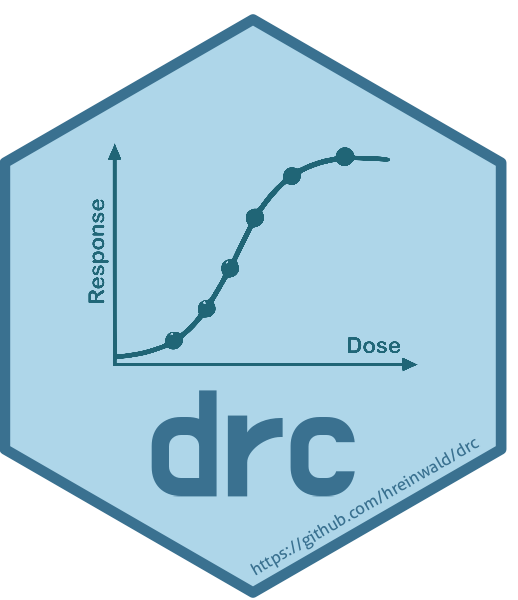

# drc — Dose-Response Curve Analysis in R

[](https://cran.r-project.org/package=drc)
[](https://cranlogs.r-pkg.org/)
[](https://github.com/hreinwald/drc/blob/dev/LICENSE)
[](https://github.com/hreinwald/drc/commits/dev)
[](https://github.com/hreinwald/drc/issues)



## Note

This repository contains a refactored development version of the
[*drc*](https://github.com/DoseResponse/drc) R package first published
by **Christian Ritz, Florent Baty, Jens C. Streibig und Daniel Gerhard**
[(2015)](https://doi.org/10.1371/journal.pone.0146021). Their
foundational work on dose–response modeling in R is gratefully
acknowledged and inspired the present refactoring.

The goal of this project is to modernize the codebase, improve
maintainability, and provide a clearer development structure while
preserving the core functionality of the original package.

This repository focuses on structural refactoring and development
improvements. Behavior and interfaces may change as the codebase is
modernized.

## Overview

The **drc** package provides a comprehensive framework for fitting,
analyzing, and visualizing dose-response curves in R. It is widely used
in bioassay, toxicology, pharmacology, and agricultural research to
model the relationship between an exposure (e.g., concentration of a
substance) or dose and a biological response.

The package offers:

- **Flexible model fitting** via the central
  [`drm()`](https://hreinwald.github.io/drc/reference/drm.md) function,
  supporting multiple data types (continuous, binomial, Poisson,
  negative binomial, event-time, and species sensitivity distributions).
- **40+ built-in parametric models** including log-logistic, Weibull,
  Gompertz, Brain-Cousens, Cedergreen, and many more, each with
  self-starting parameter initialization.
- **Effective dose (ED) estimation** with confidence intervals (delta
  method, Fieller, inverse regression) through
  [`ED()`](https://hreinwald.github.io/drc/reference/ED.md).
- **Model comparison and diagnostics**: ANOVA, lack-of-fit tests,
  Neill’s test, Box-Cox transformations, R-squared, Cook’s distance, and
  hat values.
- **Multi-curve analysis**: fit and compare dose-response curves across
  groups, compute relative potency and selectivity indices via
  [`EDcomp()`](https://hreinwald.github.io/drc/reference/EDcomp.md).
- **Robust inference**: sandwich variance estimators for
  heteroscedasticity-consistent standard errors.
- **Simulation tools**: generate random dose-response data for power
  analysis and method comparison.

For more details visit:

📖 **[drc github documentation](https://hreinwald.github.io/drc/)**  
⚡ **[drc example
workflow](https://hreinwald.github.io/drc/articles/dose-response-workflow.html)**

Feature requests or ideas?

💡 **[Post them here](https://github.com/hreinwald/drc/discussions)**

## Installation

**⚠️ Important:** We **do not recommend** installing the currently
heavily outdated CRAN version of this package. Instead, we recommend
installing the development (`dev`) or stable beta (`main_beta`) version
from GitHub.

### Install from GitHub (Recommended)

``` r
# install.packages("devtools")

# Install the re-factored development version 
devtools::install_github("hreinwald/drc")

# Install the re-factored stable beta version
devtools::install_github("hreinwald/drc@main_beta")
```

### Local Installation from tar.gz

If GitHub installation is failing, you can run the installation from the
local tar.gz file. [Download the latest
release](https://github.com/hreinwald/drc/archive/refs/tags/3.3.2.tar.gz).

After downloading the file, run the following:

``` r
# Specify the path to the directory where you saved the downloaded tar.gz file.
# Make sure to specify the correct file path below.
targz  <- file.path("~/Downloads/drc-3.3.2.tar.gz")

# Local installation with base R
install.packages(targz, repos = NULL, type = "source")
```

### Outdated CRAN Version (Not Recommended)

To install the outdated version from CRAN:

``` r
install.packages("drc")
```

## Quick Start

### Fitting a basic dose-response model

``` r
library(drc)

# Fit a four-parameter log-logistic model to the built-in 'ryegrass' dataset
model <- drm(rootl ~ conc, data = ryegrass, fct = LL.4())

# View model summary with parameter estimates and standard errors
summary(model)

# Plot the fitted dose-response curve
plot(model, xlab = "Concentration", ylab = "Root length")
```

### Estimating effective doses (ED values)

``` r
# Estimate the ED50 (dose producing 50% effect) with confidence intervals
ED(model, respLev = c(10, 50, 90), interval = "delta")
```

### Comparing curves across groups

``` r
# Fit separate curves for multiple groups
model_multi <- drm(rootl ~ conc, curveid = herbicide,
                   data = ryegrass, fct = LL.4())

# Compare ED50 values between groups
EDcomp(model_multi, percVec = c(50), interval = "delta")
```

### Model selection

``` r
# Compare different dose-response model families
mselect(model, fctList = list(W1.4(), W2.4(), LL.3()))
```

## Vignettes

The package includes detailed vignettes to help you understand specific
topics:

``` r
# View available vignettes
vignette(package = "drc")

# Access the NEC models vignette
vignette("nec-models", package = "drc")
```

## Available Models

| Function | Description |
|----|----|
| [`LL.2()`](https://hreinwald.github.io/drc/reference/LL.2.md) – [`LL.5()`](https://hreinwald.github.io/drc/reference/LL.5.md) | Log-logistic models (2 to 5 parameters) |
| [`W1.2()`](https://hreinwald.github.io/drc/reference/W1.2.md) – [`W1.4()`](https://hreinwald.github.io/drc/reference/W1.4.md) | Weibull type 1 models |
| [`W2.2()`](https://hreinwald.github.io/drc/reference/W2.2.md) – [`W2.4()`](https://hreinwald.github.io/drc/reference/W2.4.md) | Weibull type 2 models |
| [`G.3()`](https://hreinwald.github.io/drc/reference/G.3.md), [`G.4()`](https://hreinwald.github.io/drc/reference/G.4.md) | Gompertz models |
| [`LN.2()`](https://hreinwald.github.io/drc/reference/LN.2.md) – [`LN.4()`](https://hreinwald.github.io/drc/reference/LN.4.md) | Log-normal models |
| [`BC.4()`](https://hreinwald.github.io/drc/reference/BC.4.md), [`BC.5()`](https://hreinwald.github.io/drc/reference/BC.5.md) | Brain-Cousens models (hormesis) |
| [`CRS.4a()`](https://hreinwald.github.io/drc/reference/CRS.4a.md) – [`CRS.4c()`](https://hreinwald.github.io/drc/reference/CRS.4c.md) | Cedergreen-Ritz-Streibig 4-parameter models (hormesis) |
| [`CRS.5()`](https://hreinwald.github.io/drc/reference/CRS.5.md), [`CRS.5a()`](https://hreinwald.github.io/drc/reference/CRS.5a.md) – [`CRS.5c()`](https://hreinwald.github.io/drc/reference/CRS.5c.md) | Cedergreen-Ritz-Streibig 5-parameter models (hormesis) |
| [`CRS.6()`](https://hreinwald.github.io/drc/reference/CRS.6.md) | Generalised Cedergreen-Ritz-Streibig model (hormesis) |
| [`UCRS.4a()`](https://hreinwald.github.io/drc/reference/UCRS.4a.md) – [`UCRS.4c()`](https://hreinwald.github.io/drc/reference/UCRS.4c.md) | U-shaped Cedergreen-Ritz-Streibig 4-parameter models (hormesis) |
| [`UCRS.5a()`](https://hreinwald.github.io/drc/reference/UCRS.5a.md) – [`UCRS.5c()`](https://hreinwald.github.io/drc/reference/UCRS.5c.md) | U-shaped Cedergreen-Ritz-Streibig 5-parameter models (hormesis) |
| [`NEC.2()`](https://hreinwald.github.io/drc/reference/NEC.2.md) – [`NEC.4()`](https://hreinwald.github.io/drc/reference/NEC.4.md) | No-effect-concentration models |
| [`L.3()`](https://hreinwald.github.io/drc/reference/L.3.md) – [`L.5()`](https://hreinwald.github.io/drc/reference/L.5.md) | Logistic models |
| [`baro5()`](https://hreinwald.github.io/drc/reference/baro5.md) | Baro five-parameter model |
| [`gammadr()`](https://hreinwald.github.io/drc/reference/gammadr.md) | Gamma dose-response model |

## Key Functions

| Function | Purpose |
|----|----|
| [`drm()`](https://hreinwald.github.io/drc/reference/drm.md) | Fit dose-response models |
| [`ED()`](https://hreinwald.github.io/drc/reference/ED.md) | Estimate effective doses (ED10, ED50, …) |
| [`maED()`](https://hreinwald.github.io/drc/reference/maED.md) | Model averaged estimate effective doses (ED10, ED50, …) |
| [`EDcomp()`](https://hreinwald.github.io/drc/reference/EDcomp.md) | Compare ED values between curves |
| [`compParm()`](https://hreinwald.github.io/drc/reference/compParm.md) | Compare model parameters between curves |
| [`noEffect()`](https://hreinwald.github.io/drc/reference/noEffect.md) | Testing if there is a dose effect at all |
| [`plot()`](https://rdrr.io/r/graphics/plot.default.html) | Plot fitted dose-response curves |
| [`summary()`](https://rdrr.io/r/base/summary.html) | Model summary with parameter estimates |
| [`anova()`](https://rdrr.io/r/stats/anova.html) | ANOVA and lack-of-fit tests |
| [`mselect()`](https://hreinwald.github.io/drc/reference/mselect.md) | Model selection among candidate models |
| [`predict()`](https://rdrr.io/r/stats/predict.html) | Predictions with confidence/prediction intervals |
| [`modelFit()`](https://hreinwald.github.io/drc/reference/modelFit.md) | Goodness-of-fit test |
| [`Rsq()`](https://hreinwald.github.io/drc/reference/Rsq.md) | R-squared calculation |
| [`rdrm()`](https://hreinwald.github.io/drc/reference/rdrm.md) | Simulate dose-response data |

## Data Types Supported

The [`drm()`](https://hreinwald.github.io/drc/reference/drm.md) function
supports multiple response types via the `type` argument:

- **`"continuous"`** (default): Standard continuous dose-response data.
- **`"binomial"`**: Quantal/binary response data (e.g., proportion of
  individuals affected).
- **`"Poisson"`**: Count data following a Poisson distribution.
- **`"negbin1"`, `"negbin2"`**: Negative binomial count data.
- **`"event"`**: Event-time / time-to-event data (e.g., germination
  time).
- **`"ssd"`**: Species sensitivity distributions for ecotoxicology.

## Dependencies

**drc** depends on: - R (≥ 4.0.0), MASS, stats

and imports from: car, graphics, gtools, lifecycle, multcomp, plotrix,
sandwich, scales, utils.

## References

- Ritz, C., Baty, F., Streibig, J. C., and Gerhard, D. (2015).
  Dose-Response Analysis Using R. *PLOS ONE*, 10(12), e0146021.
- Ritz, C. and Streibig, J. C. (2005). Bioassay Analysis using R.
  *Journal of Statistical Software*, 12(5), 1–22.

## Bug Reports

Please report issues with this re-factory version
[here](https://github.com/hreinwald/drc/issues/).

## License

GPL-2.0
